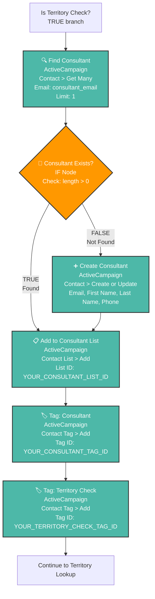

# ActiveCampaign Nodes - Visual Diagram

## Mermaid Flowchart



## ASCII Diagram

```
┌─────────────────────────┐
│ Is Territory Check?     │
│ (TRUE branch)           │
└────────────┬────────────┘
             │
             ▼
┌─────────────────────────────────────┐
│ ① Find Consultant                   │
│ ═══════════════════════════════════ │
│ Type: ActiveCampaign                │
│ Resource: Contact                   │
│ Operation: Get Many                 │
│ ─────────────────────────────────── │
│ Return All: false                   │
│ Limit: 1                            │
│ Email: {{ $json.consultant_email }} │
│ Continue on Fail: true              │
└────────────┬────────────────────────┘
             │
             ▼
        ┌────────────────────┐
        │ ② Consultant       │
        │    Exists?         │
        │ ═══════════════    │
        │ Type: IF           │
        │ Condition:         │
        │ length > 0         │
        └─────┬──────┬───────┘
              │      │
         TRUE │      │ FALSE
              │      │
              │      ▼
              │  ┌─────────────────────────────────────┐
              │  │ ③ Create Consultant                 │
              │  │ ═══════════════════════════════════ │
              │  │ Type: ActiveCampaign                │
              │  │ Resource: Contact                   │
              │  │ Operation: Create or Update         │
              │  │ ─────────────────────────────────── │
              │  │ Email: consultant_email             │
              │  │ First Name: consultant_first_name   │
              │  │ Last Name: consultant_last_name     │
              │  │ Phone: consultant_phone             │
              │  └─────────────┬───────────────────────┘
              │                │
              └────────────────┘
                       │
                       ▼
┌─────────────────────────────────────┐
│ ④ Add to Consultant List            │
│ ═══════════════════════════════════ │
│ Type: ActiveCampaign                │
│ Resource: Contact List              │
│ Operation: Add                      │
│ ─────────────────────────────────── │
│ List: YOUR_CONSULTANT_LIST_ID       │
│ Contact: {{ $json.id }}             │
└────────────┬────────────────────────┘
             │
             ▼
┌─────────────────────────────────────┐
│ ⑤ Tag: Consultant                   │
│ ═══════════════════════════════════ │
│ Type: ActiveCampaign                │
│ Resource: Contact Tag               │
│ Operation: Add                      │
│ ─────────────────────────────────── │
│ Contact: {{ $json.id }}             │
│ Tag: YOUR_CONSULTANT_TAG_ID         │
└────────────┬────────────────────────┘
             │
             ▼
┌─────────────────────────────────────┐
│ ⑥ Tag: Territory Check              │
│ ═══════════════════════════════════ │
│ Type: ActiveCampaign                │
│ Resource: Contact Tag               │
│ Operation: Add                      │
│ ─────────────────────────────────── │
│ Contact: {{ $json.id }}             │
│ Tag: YOUR_TERRITORY_CHECK_TAG_ID    │
└────────────┬────────────────────────┘
             │
             ▼
┌─────────────────────────┐
│ IF: All Required        │
│ Fields Present?         │
│ (Territory Lookup)      │
└─────────────────────────┘
```

## Node-by-Node Details

### Node ① - Find Consultant (ActiveCampaign)
**Purpose:** Search for existing consultant by email
- **Node Type:** ActiveCampaign
- **Resource:** Contact
- **Operation:** Get Many (or Get All)
- **Config:**
  - Return All: `false`
  - Limit: `1`
  - Additional Fields → Email: `={{ $json.consultant_email }}`
  - Continue on Fail: `true` ✓

### Node ② - Consultant Exists? (IF)
**Purpose:** Check if consultant was found
- **Node Type:** IF (Core Node)
- **Condition Type:** Number
- **Config:**
  - Value 1: `={{ $json.length }}`
  - Operation: `larger`
  - Value 2: `0`

### Node ③ - Create Consultant (ActiveCampaign)
**Purpose:** Create new consultant if not found
- **Node Type:** ActiveCampaign
- **Resource:** Contact
- **Operation:** Create or Update
- **Config:**
  - Email: `={{ $json.consultant_email }}`
  - Update if Exists: `true` ✓
  - Additional Fields:
    - First Name: `={{ $json.consultant_first_name }}`
    - Last Name: `={{ $json.consultant_last_name }}`
    - Phone: `={{ $json.consultant_phone }}`

### Node ④ - Add to Consultant List (ActiveCampaign)
**Purpose:** Add consultant to "Franchise Consultants" list
- **Node Type:** ActiveCampaign
- **Resource:** Contact List
- **Operation:** Add
- **Config:**
  - List: `YOUR_CONSULTANT_LIST_ID` (replace with actual ID)
  - Contact: `={{ $json.id }}`

### Node ⑤ - Tag: Consultant (ActiveCampaign)
**Purpose:** Tag contact as "Consultant"
- **Node Type:** ActiveCampaign
- **Resource:** Contact Tag
- **Operation:** Add
- **Config:**
  - Contact: `={{ $json.id }}`
  - Tag: `YOUR_CONSULTANT_TAG_ID` (replace with actual ID)

### Node ⑥ - Tag: Territory Check (ActiveCampaign)
**Purpose:** Tag that consultant submitted a territory check
- **Node Type:** ActiveCampaign
- **Resource:** Contact Tag
- **Operation:** Add
- **Config:**
  - Contact: `={{ $json.id }}`
  - Tag: `YOUR_TERRITORY_CHECK_TAG_ID` (replace with actual ID)

## Data Flow

### Input (from "Is Territory Check" TRUE branch):
```json
{
  "consultant_email": "rich@veteranfranchiseadvisers.com",
  "consultant_first_name": "Richard",
  "consultant_last_name": "Ashe",
  "consultant_phone": "(713) 849-9642",
  "network": "FBA",
  "prospect_name": "Justin Dearing",
  "territory_requested": "Leander, TX 78641"
}
```

### After Node ①:
```json
// If found:
[{ "id": "123", "email": "rich@...", ... }]
// length = 1

// If not found:
[]
// length = 0
```

### After Node ③ (if created):
```json
{
  "id": "456",
  "email": "rich@veteranfranchiseadvisers.com",
  "firstName": "Richard",
  "lastName": "Ashe",
  "phone": "(713) 849-9642"
}
```

### After Node ④, ⑤, ⑥:
All subsequent nodes use `{{ $json.id }}` to reference the contact ID from either Node ① (existing) or Node ③ (newly created).

## Connection Summary

| From Node | Output | To Node |
|-----------|--------|---------|
| Is Territory Check | TRUE (0) | Find Consultant |
| Find Consultant | main | Consultant Exists? |
| Consultant Exists? | TRUE (0) | Add to Consultant List |
| Consultant Exists? | FALSE (1) | Create Consultant |
| Create Consultant | main | Add to Consultant List |
| Add to Consultant List | main | Tag: Consultant |
| Tag: Consultant | main | Tag: Territory Check |
| Tag: Territory Check | main | IF: All Required Fields Present? |

## Key Points

1. **Two paths converge:** Both "found existing" and "created new" paths merge at "Add to Consultant List"
2. **Contact ID propagation:** The `{{ $json.id }}` is available after either path
3. **Idempotent:** Running twice with same email won't create duplicates (due to "Update if Exists")
4. **Error resilient:** "Continue on Fail" on Find Consultant prevents workflow crash if ActiveCampaign is down
